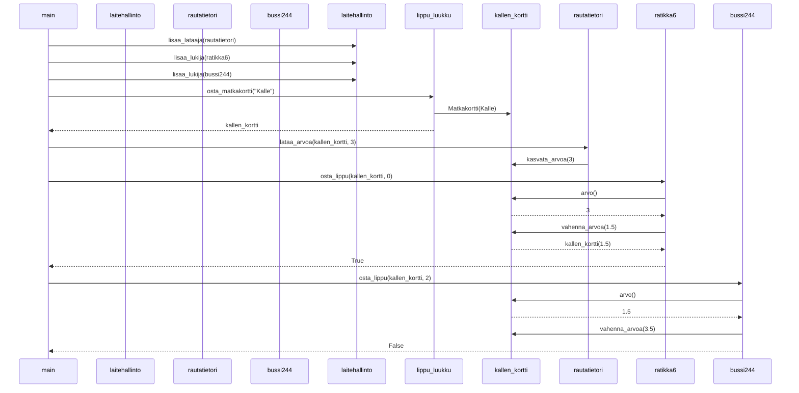

```mermaid
sequenceDiagram

  participant main
  participant HKILaitehallinto as laitehallinto
  participant Lataajalaite as rautatietori
  participant Lukijalaite as ratikka6
  participant Lukijalaite as bussi244

  main ->> laitehallinto: lisaa_lataaja(rautatietori) 
  main ->> laitehallinto: lisaa_lukija(ratikka6) 
  main ->> laitehallinto: lisaa_lukija(bussi244) 
 
  main ->> lippu_luukku: osta_matkakortti("Kalle")
  lippu_luukku ->> kallen_kortti: Matkakortti(Kalle)
  lippu_luukku -->> main: kallen_kortti
  main ->> rautatietori: lataa_arvoa(kallen_kortti, 3)
  rautatietori ->> kallen_kortti: kasvata_arvoa(3)

  main ->> ratikka6: osta_lippu(kallen_kortti, 0)
  ratikka6 ->> kallen_kortti: arvo()
  kallen_kortti -->> ratikka6: 3

  ratikka6 ->> kallen_kortti: vahenna_arvoa(1.5)
  kallen_kortti -->> ratikka6: kallen_kortti(1.5) 
  ratikka6 -->> main: True 

  main ->> bussi244: osta_lippu(kallen_kortti, 2)
  bussi244 ->> kallen_kortti: arvo()
  kallen_kortti -->> bussi244: 1.5
  bussi244 ->> kallen_kortti: vahenna_arvoa(3.5)
  bussi244 -->> main: False
```