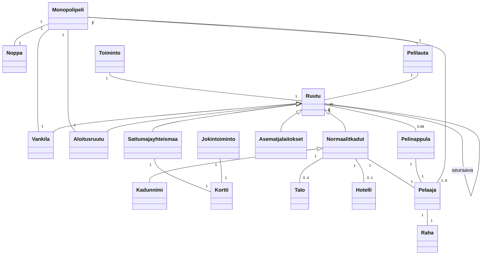

```mermaid
 classDiagram
      Monopolipeli "1" -- "2" Noppa
      Monopolipeli "1" -- "1" Pelilauta
      Monopolipeli "1" -- "1" Vankila
      Monopolipeli "1" -- "1" Aloitusruutu
      Toiminto "1" -- "1" Ruutu
    
      Pelilauta "1" -- "40" Ruutu
      Ruutu "1" -- "1" Ruutu: seuraava
      Ruutu "1" -- "0.08" Pelinappula
      Ruutu <|-- Aloitusruutu
      Ruutu <|-- Vankila
      Ruutu <|-- Sattuma ja yhteismaa  
      Ruutu <|-- Asemat ja laitokset
      Ruutu <|-- Normaalit kadut
      Normaalit kadut <|-- Kadunnimi

      Sattuma ja yhteismaa "1" -- "1" Kortti
      Jokin toiminto "1" -- "1" Kortti

      Normaalit kadut "1" -- "0..4" Talo
      Normaalit kadut "1" -- "0..1" Hotelli
      Normaalit kadut "1" -- "1" Pelaaja
      Pelaaja "1" -- "1" Raha
      Pelinappula "1" -- "1" Pelaaja
      Pelaaja "2..8" -- "1" Monopolipeli


```