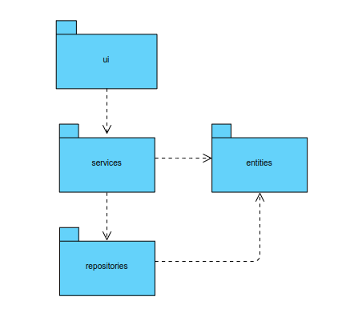
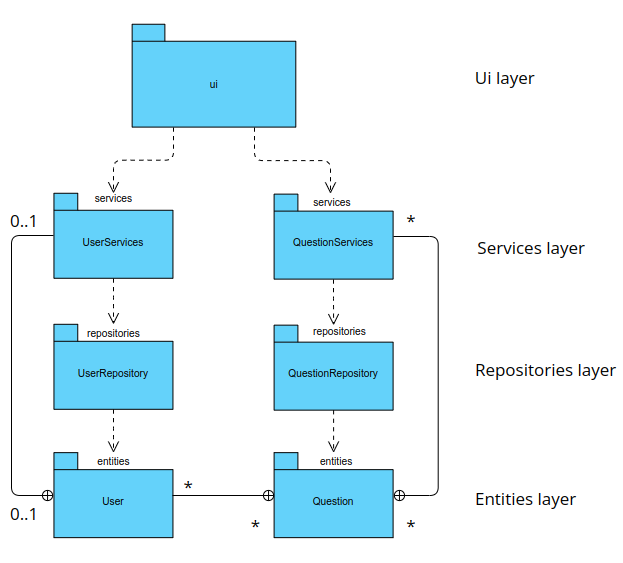
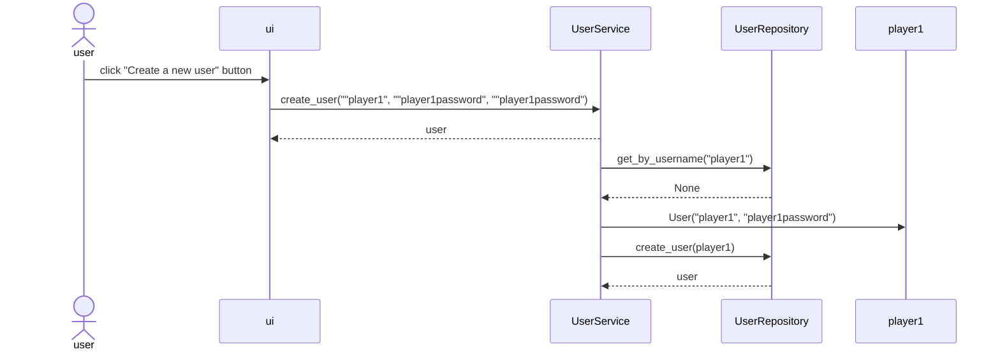
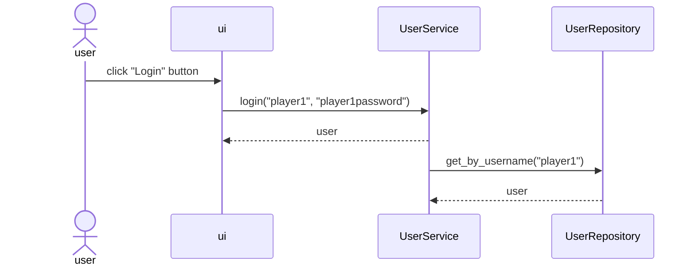
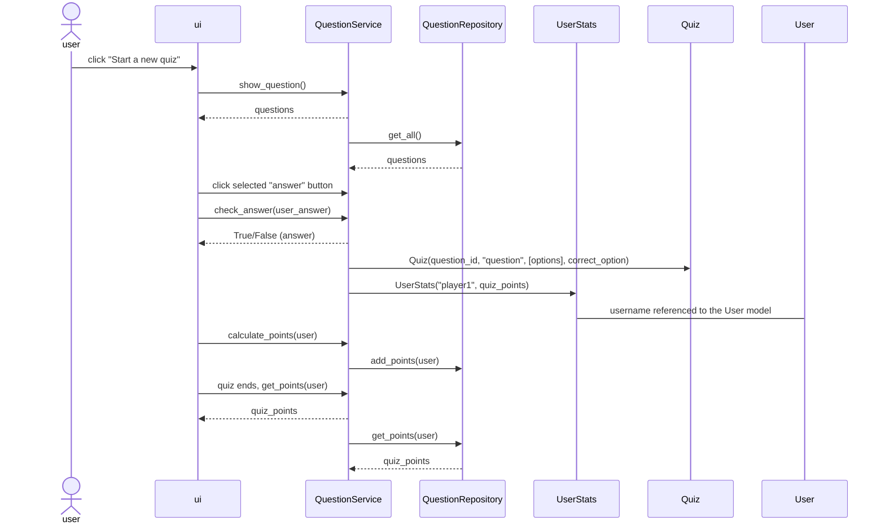

## Project overall, high-level structure

## Project packaging class structure
Ui uses the classes from services layer (UserService, QuestionService) for the application logic.

Services uses classes from repositories layer (UserRepository, QuestionRepository) to get the user and question data to application logic and for processing it. Services is also using Entities classes i.e. for user login.

Repositories uses entities classes in data processing.

Entities are the data models, representing the data structure in the application. 
Entities class User can have multiple questions as well as the Question class can have multiple users. 
Entities has also class UserStats, which is referenced by username to the User class and database table.

## Projects main functionalities
Below diagrams presents the main functionalities and features of the application.

These are creating a new user, user login and user starting / playing the quiz.

### Create a new user
In the view of creating a new user, the user inputs "username", "password", "password" and clicks "Create a new user" button. 
Ui (user interface) calls the application logics method create_user from the UserService class.  The parameters are the given username, password, password. UserService then checks with the UserRepository class if the user is already created, if not then a new User object is created. UserService checks also if certain conditions for username and password complexity is met, if not, the application gives a message to the user.

At the time of creating a new user the UserRepository adds also the username and quiz_points (0 by default for a new user) to the user_stats table, which is used when the user plays the quiz for keeping up the points.

When the new User is succesfully created, it is routed directly to the user page.

Below visualizes the process of creating a new user.

### User login
In the view of user login, the user inputs username and password and clicks "login" button. Ui calls the login method from UserService class, which checks with UserRepository class that if there is a user with the given name and password and finally returns an user object to the ui.

Below visualizes the process of user login.

### User starting / playing the quiz
In the user page, the user clicks "Start a new quiz" to began the quiz.

The ui calls show_questions() method from the application logic, QuestionService class, which returns a list of questions and answers with a help of get_all() method from QuestionRepository class. 

The questions are shown to the user one by one. The user will select an answer, which triggers a call of check_answer(user_answer) method in QuestionService. This method returns boolean value true or false depending on the user_answer. If the user_answer was correct, the user (UserStats object; username, quiz_points) will get one point and if the answer was incorrect, zero points and this is done with calculate_points(user) in QuestionService and add_points(user) in QuestionRepository. When the user has answered to all of the questions, get_points(user) is triggered both in services and repositories for getting the final score of the user.

UserStats is referenced to User via username to keep up the score of correct user.  Quiz class helds the data model of id, question, options and correct option for all of the questions.

