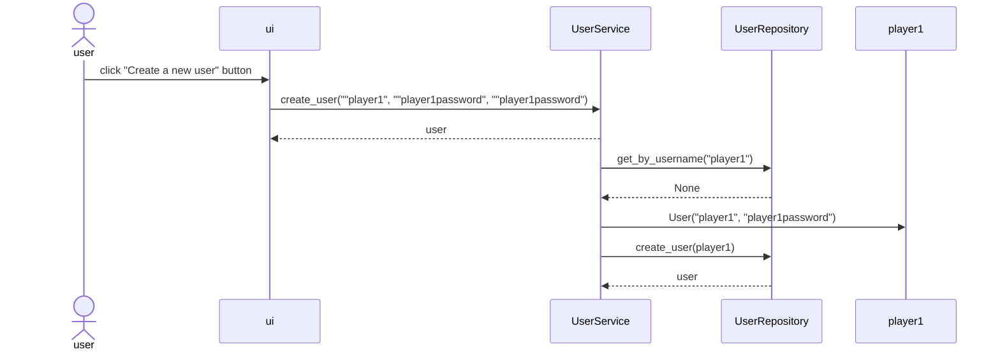
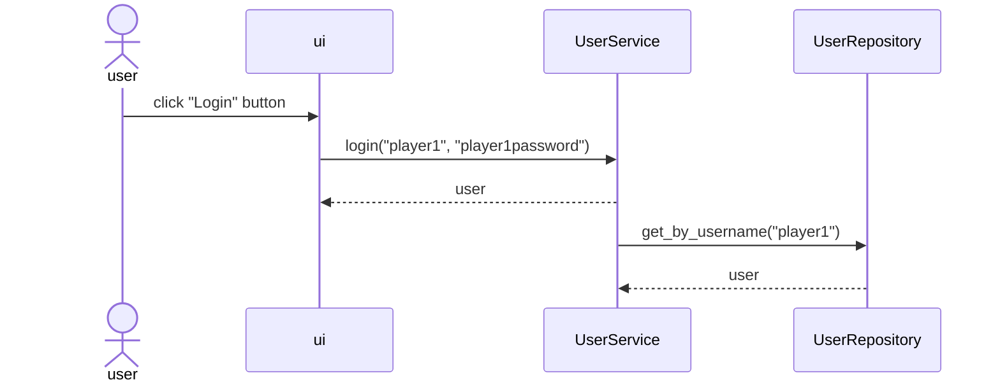
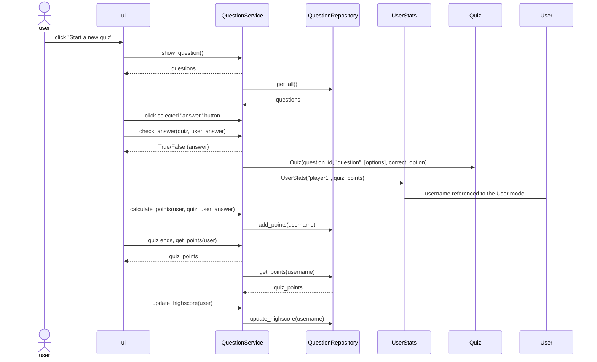
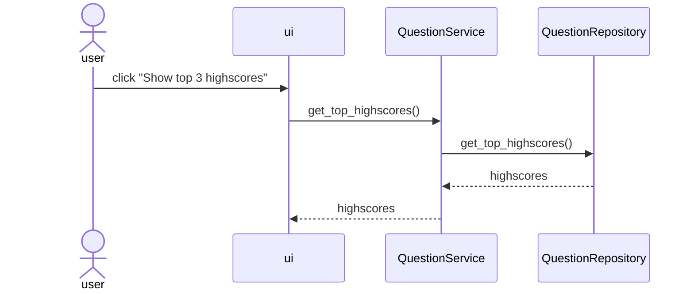

# Project architecture
## High-level structure
The application has three layers, which are ui, services and repositories. 
* Ui takes care of the *user interface actions*
* Services handles the *application logic*
* Repositories handles the *database operations*
* In addition, entities are used as *data models* in services and repositories

Below is the packaging class structure of the project.

## User interface
The user interface has views for the following:
* Login 
* Create a new user
* User page
* Highscore page
* Quiz page

UI is the highest class handling which of the user interface views are shown and at what time. 
All of the ui views are done with own classes, which then calls the service layers, [QuestionServices](../src/services/question_service.py) or [UserServices](../src/services/user_service.py) methods.  

The application is done in a way that the user interface and application logic would be differentiated as much as possible.

When the user has created a new user account and logged in it is possible to start the quiz. 
When the user starts the quiz, the [QuizPage](../src/ui/quiz_page.py) ui class is taking care that the questions are rendered to the user playing the quiz correctly, with help of the application logic from services layer.

## Application logic and detailed structure
Entities classes [User and UserStats](../src/entities/user.py) and [Quiz](../src/entities/quiz.py) are the data models for the application.  
User and UserStats are linked to each other in the database with 'username'. 
Quiz is used to create the quiz questions and to perform application logic. 
Entities class User can have multiple questions as well as the Question class can have multiple users. 

Application logic is handled with [QuestionServices](../src/services/question_service.py) and [UserServices](../src/services/user_service.py), which has e.g. the following methods:
* `create_user(username, password, password2, login)`
* `login(username, password)`
* `create_question(question_id, question, options, correct_option)`
* `check_answer(quiz, user_answer)`
* `calculate_points(user, quiz, user_answer)`

Services uses classes from repositories layer [UserRepository](../src/repositories/user_repository.py) and [QuestionRepositoriy](../src/repositories/question_repository.py) to get the user and question data to application logic from the database and for processing it. Dependency injection is used in the services as giving the repositories directly as default parameter in the classes constructors.

Below packaging class structure shows the [QuestionServices](../src/services/question_service.py) and [UserServices](../src/services/user_service.py) relation with other application layers.

## Data storage
SQLite database is used to store the data for the project.

Repositories classes [UserRepository](../src/repositories/user_repository.py) and [QuestionRepositoriy](../src/repositories/question_repository.py) are used to store and fetch the data from the database. 

The overall database schema and tables are [initialized](../src/initialize_database.py) in separate file and the questions are setup to the database and to users with method [initialize_questions](../src/initialize_questions.py).

The project utilizes the repository type of project model and application logic is tested so that the tests uses the main memory.

## Projects main functionalities
Below diagrams presents the main functionalities and features of the application.

These are creating a new user, user login and user starting / playing the quiz.

### Create a new user
In the view of creating a new user, the user inputs "username", "password", "password" and clicks "Create a new user" button. 
Ui (user interface) calls the application logics method create_user from the [UserService](../src/services/user_service.py) class.  The parameters are the given username, password, password. [UserService](../src/services/user_service.py) then checks with the [UserRepository](../src/repositories/user_repository.py) class if the user is already created, if not then a new User object is created. [UserService](../src/services/user_service.py) checks also if certain conditions for username and password complexity is met, if not, the application gives a message to the user.

At the time of creating a new user the [UserRepository](../src/repositories/user_repository.py) adds also the username, quiz_points and highscore (both 0 by default for a new user) to the user_stats table, which is used when the user plays the quiz for keeping up the points.

When the new User is succesfully created, it is routed directly to the user page.

Below visualizes the process of creating a new user.

### User login
In the view of user login, the user inputs username and password and clicks "login" button. Ui calls the `login` method from [UserService](../src/services/user_service.py) class, which checks with [UserRepository](../src/repositories/user_repository.py) class that if there is a user with the given name and password and finally returns an user object to the ui.

Below visualizes the process of user login.

### User starting / playing the quiz
In the user page, the user clicks "Start a new quiz" to began the quiz.

The ui calls `show_questions()` method from the application logic, [QuestionService](../src/services/question_service.py) class, which returns a list of questions and answers with a help of `get_all()` method from [QuestionRepository](../src/repositories/question_repository.py) class. The questions are shown to the user one by one. 

The user will select an answer, which triggers a call of `check_answer(quiz, user_answer)` method in [QuestionService](../src/services/question_service.py). This method returns boolean value true or false depending on the user_answer. If the user_answer was correct, the user (UserStats object; username, quiz_points) will get one point and if the answer was incorrect, zero points and this is done with `calculate_points(user, quiz, user_answer)` in [QuestionService](../src/services/question_service.py) and `add_points(user)` in [QuestionRepository](../src/repositories/question_repository.py). When the user has answered to all of the questions, `get_points(user)` is triggered both in services and repositories for getting the final score of the user.

Highscores are updated for the users in the [QuestionServices](../src/services/question_service.py) with method `update_highscore(user)`. 
The update is based on logic that if the user's quiz points are higher than previous highscore or not.

UserStats is referenced to User via username to keep up the score of correct user.  Quiz class helds the data model of id, question, options and correct option for all of the questions.

### Highscores
In the user page, the user can click "*show top 3 highscores*", to see the best three users and their points.

The ui calls the `get_top_highscores()` from the application logic, which fetches the details by calling the repositories layer. 

### Possible other features
All of the project features follows the similar approach as described above.

The user interface calls the application logic in services, which then calls the repositories layer to get or update also the details in the database.