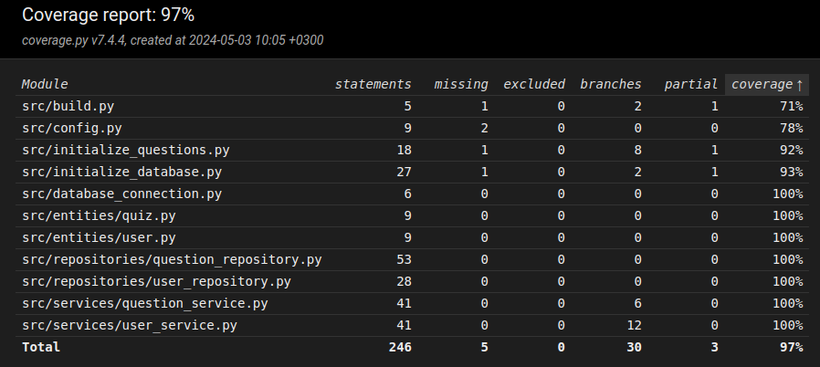

# Testing document
The application has been tested with automatic unit and integration tests with unittest and manually within the system level.<br> 
In addition, it was tested that the application and database generates the quiz questions succesfully.

## Unit and integration tests

### Application logic - services layer
[QuestionServices](../src/services/question_service.py) and [UserService](../src/services/user_service.py) classes handle the application logic of the program. <br>
These both have been tested with different test cases with unittest Python framework. 

Test files can be accessed here: [TestQuestionService](../src/tests/services/question_service_test.py) and [TestUserService](../src/tests/services/user_service_test.py).

Unittesting was conducted for both by injecting repository objects and this was done to store the test data to the memory and not to the database. The repository objects were ```FakeQuestionRepository``` and ```FakeUserRepository```, which models the repository operations.

### Database operations and handling - repositories layer
[UserRepository](../src/repositories/user_repository.py) and [QuestionRepositoriy](../src/repositories/question_repository.py) classes handle the database operations within SQLite. <br>
These classes were also tested with unit testing. 

Test files can be accessed here: [TestQuestionRepository](../src/tests/repositories/question_repository_test.py) and [TestUserRepository](../src/tests/repositories/user_repository_test.py).

Repository tests used a test database to store the data and the configuration can be found from the .env.test file.

In addition, tests were performed to ensure the questions are initialized correctly by mocking the function, these tests can be accessed here: [TestInitializeQuestions](../src/tests/databases/initialize_questions_test.py).

### Testing coverage
Total branch testing coverage is **97%** and this does not include user interface testing as it was outscoped from this project.



No testing was performed for *build.py* and *initialize_database.py* files, however these could have been left out from the testing coverage or tested from the command line. *initialize_questions.py* was also not tested from the command line. In addition it was not tested that the .env file is not existing, this decreases the coverage in *config.py* file.


## System testing
System testing was performed manually.

### Installation and configuration
The application has been tested by following the [User manual](../documentation/user_manual.md) for *Linux* environment.<br>
Configuration for .env variable was tested with different names as well.

### Features
All of the features in the [Requirements specification](../documentation/requirements_specification.md) have been checked and it has been tried to add invalid entries to the application's input fields, such as empty values.

## Known quality issues
The application does not automatically create the databases for users or questions, thus, these needs to be initialized manually.<br> 
The instructions and commands for the initialization is part of the user manual.