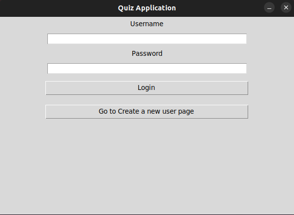
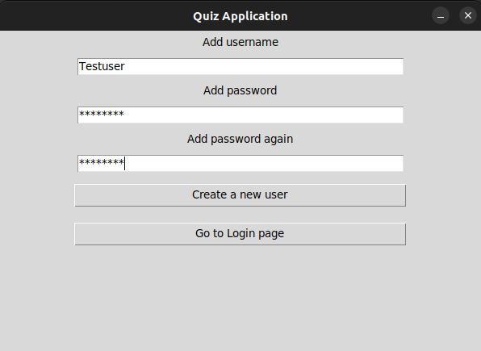
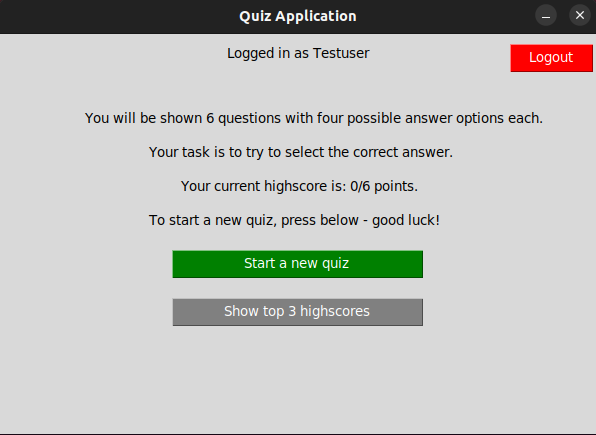
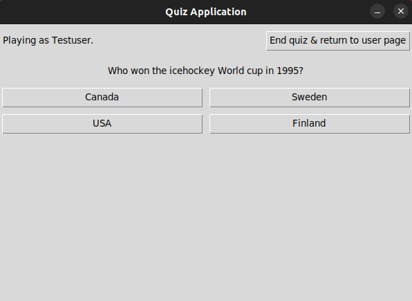
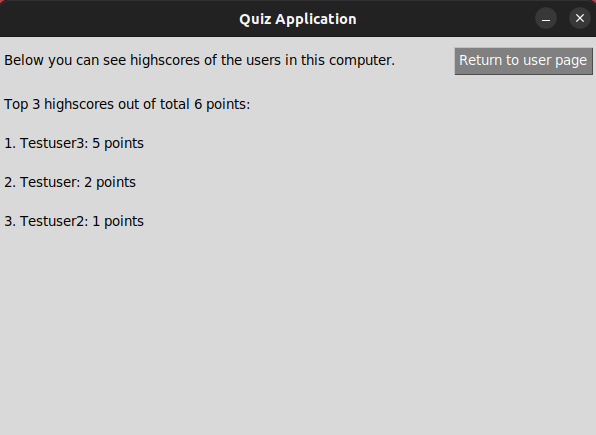

# User manual
The latest project release can be downloaded from [Final release](https://github.com/mikaelri/ot-harjoitustyo/releases/tag/final-release).

## Configuration
You can rename the file used for data storage, by default it is named as below. Renaming can be done in the .*env* file. <br>
Files are created automatically inside the data folder if it does not contain already those.


```
DATABASE_FILENAME=quizapp.sqlite
```

## Starting the application
Before starting the application do the following inside the **quiz-app** folder:

1. Install the dependencies and requirements with command:
```
poetry install
```

2. Create the database and initialize the questions for the quiz with command:
```
poetry run invoke create
```

3. You can now start the application with command:
```
poetry run invoke start
```

## Login 
Application will start to the login view:



User can login by typing an existing username and password and clicking "Login" button.
## Creating a new user
A new user can be created by clicking "Go to Create a new user page" in the login view after user will see:



User can create a new user account if the username does not exists already. <br>
Username must be at least 3 and password 6 characters long.<br>
After selecting the username and password user can press "Create a new user".<br>
If the new user was created succesfully, it will be navigated directly to the user page.

## User page, playing the quiz and viewing the highscores
User can go to the user page after succesfully creating a new user or by using login.<br>
After that application will display the user page:



User page has three features:

1. User can logout from the top right corner and it navigates to the main page.
   
2. User can start a new quiz by clicking "Start a new quiz", which will display:



Quiz view has fixed amount of questions for the user to answer.<br>
Once the user has answered all of the questions, the application will show the total score.<br>
User can end the quiz by clicking the top right corner, the points gathered will be saved.

3. User can view the highscores by clicking "Show top 3 highscores", which will display:



Highscores are gathered from the users of the same computer and are shown in ranking order based on the quiz points.<br> 
From the highscore page the user can return to the user page by clicking the top right corner button.
